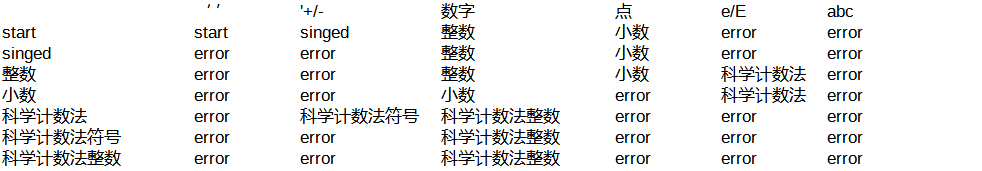

# 自动状态机解析

## 作用

解析Excel 中的自动状态机信息，解析成指定语言的代码。当前实现的代码有JavaScript,Java

## 效果

Excel 文件内容



```javascript
let com.storyteller_f.asmp.output.map=new Map();
com.storyteller_f.asmp.output.map.set("整数",["error","error","整数","小数","科学计数法","error"]);
com.storyteller_f.asmp.output.map.set("科学计数法",["error","科学计数法符号","科学计数法整数","error","error","error"]);
com.storyteller_f.asmp.output.map.set("科学计数法整数",["error","error","科学计数法整数","error","error","error"]);
com.storyteller_f.asmp.output.map.set("singed",["error","error","整数","小数","error","error"]);
com.storyteller_f.asmp.output.map.set("start",["start","singed","整数","小数","error","error"]);
com.storyteller_f.asmp.output.map.set("科学计数法符号",["error","error","科学计数法整数","error","error","error"]);
com.storyteller_f.asmp.output.map.set("小数",["error","error","小数","error","科学计数法","error"]);
```